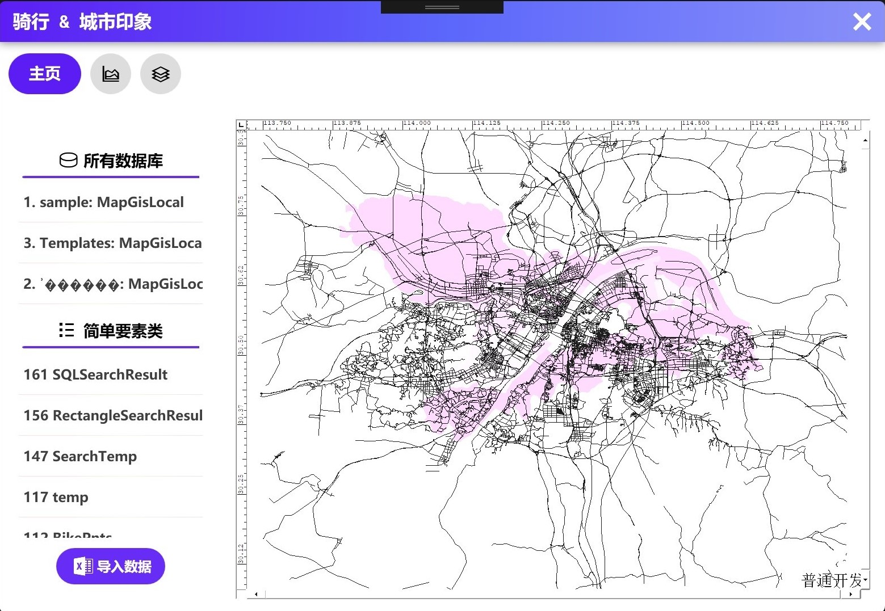
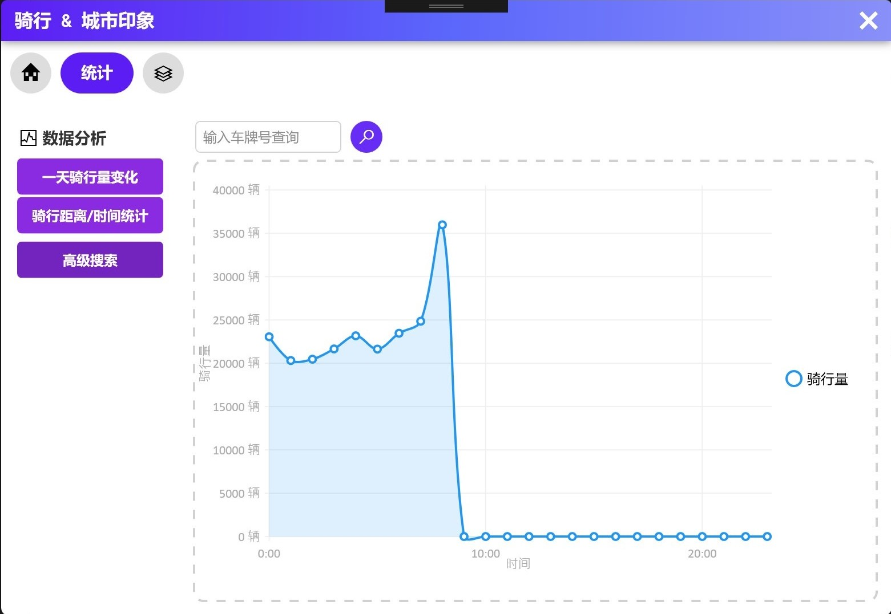
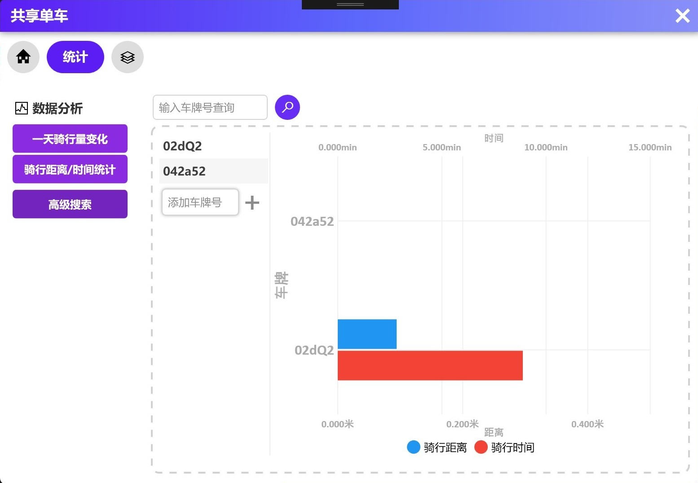
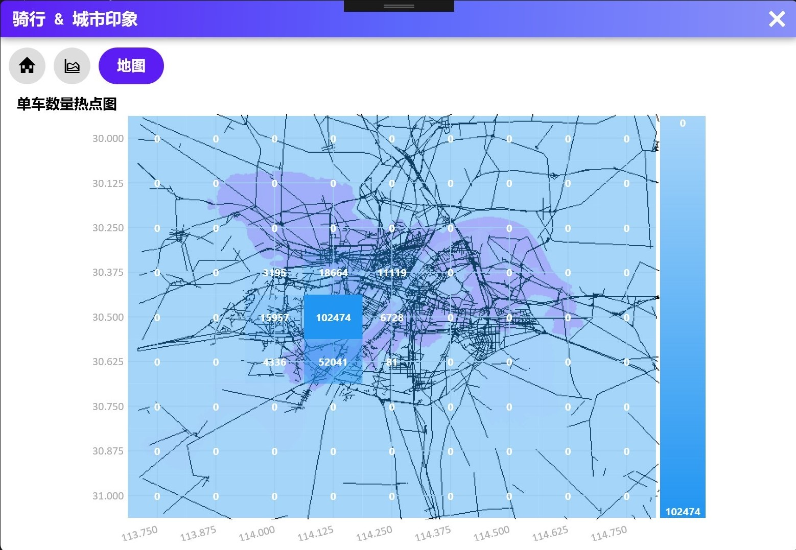

# MapGIS-WPF
## <b>中地数码 MapGIS 二次开发客户端</b>

### MapGIS
> MapGIS 是中国地质大学开发的通用工具型地理信息系统软件，它是在享有盛誉的地图编辑出版系统的 MAPCAD 基础上发展起来的，可对空间数据进行采集、存储、检索、分析和图形表示。MAPGIS 包括了 MAPCAD 的全部基本制图功能，可以制作具有出版精度的十分复杂的地形图和地质图。同时，它能对地形数据与各种专业数据进行一体化管理和空间分析查询，从而为多源地学信息的综合分析提供了一个理想的平台。

### 应用简介
这是根据 MapGIS 官方文档制作的一个简易的 WPF 应用程序，不过热力图功能还不够完善，是用方格块来展现的。

### 截图

#### csv 文件导入

#### 一天不同时段骑行量统计

#### 骑行距离统计

#### SQL 语句查询

#### 表格热力图

2019 ShockJockey.
